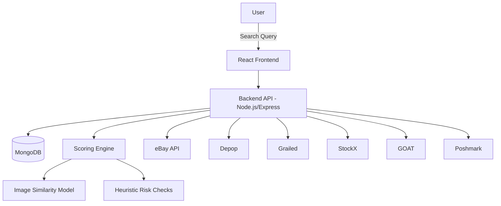

# Sneaker Resale Risk Scoring Aggregator - Architecture

## 🎯 Purpose
A sneaker-exclusive **listing aggregator and risk scoring system** built with **React (frontend)**, **Node.js/Express (backend)**, and **MongoDB (database)**. The platform consolidates listings from multiple resale marketplaces and applies **AI + heuristic scoring** to estimate trustworthiness.

---

## 🌐 System Overview

---

## ⚙️ Core Flow

1. User searches for a sneaker (e.g., “Air Jordan 1 Chicago”).
2. Backend fetches listings from APIs/scrapers (eBay, Grailed, etc.).
3. Data normalized into standard schema → { title, price, size, seller, condition, images }.
4. Risk Scoring Engine evaluates listings via:
   - **Heuristics:** Seller reputation, account age, return policy, price deviation.
   - **AI Similarity:** CLIP embeddings check images against reference gallery.
   - **Quality Checks:** Resolution, photo angles, duplicate image hashes.
5. Results ranked by **Price & Risk Score**.
6. Frontend displays cards with listing info + Low/Medium/High risk tag.

---

## 🧩 Subsystems

### Frontend (React + Tailwind)
- Search bar for sneaker queries.
- Results grid with filters (size, price, condition).
- Favorites + saved searches dashboard.

### Backend (Node.js/Express)
- Routes for `/search`, `/favorites`, `/alerts`.
- Integrations for eBay, Depop, Grailed, StockX, GOAT, Poshmark.
- Scoring Engine combining heuristics + AI.

### Database (MongoDB)
- `Listings` → Cached search results.
- `Users` → Favorites, saved searches.
- `Alerts` → Notifications config.

### Scoring Engine
- Combines 4 factors:
  1. Price anomaly detection.
  2. Seller history/reputation.
  3. Image similarity (CLIP/ViT embeddings).
  4. Listing quality/resolution.
- Returns normalized 0–100 score → mapped to Low/Medium/High risk.

---

## 🔗 Integrations
- **APIs:** eBay, Grailed, Depop (via scraping/API), StockX, GOAT, Poshmark.
- **AI Models:** OpenAI CLIP, TensorFlow.js for image embeddings.
- **Hosting:** Vercel (frontend), Render/VPS (backend).

---

## 💡 Strengths
- Unified sneaker search across fragmented resale markets.
- Risk-aware scoring instead of binary “authentic vs fake.”
- Transparent reasoning for trust estimates.
- Modular architecture for adding new marketplaces.

---

## 🔮 Future Work
- Expand supported platforms (KLEKT, Stadium Goods, Flight Club).
- Add notifications via SMS/Discord/email.
- Dashboard with historical price trends.
- Model-specific part detectors for AJ1, Yeezy, Dunk silhouettes.
