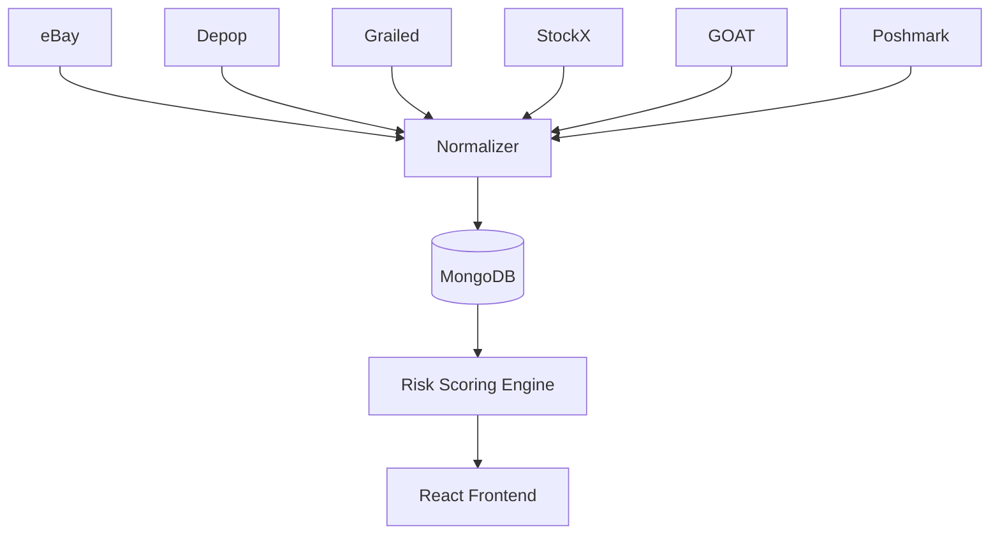

# Sneaker Resale Risk Scoring Aggregator - Integrations

## 🎯 Purpose
The platform integrates with **sneaker resale marketplaces** to collect listing data, normalize it into a unified schema, and apply risk scoring.

---

## 🌐 Target Marketplaces

### ✅ High Priority
- **eBay** → Public API available; rich sneaker marketplace.
- **Depop** → Requires scraping/API reverse-engineering.
- **Grailed** → API limited; scraping often required.
- **StockX** → Semi-closed API; can access via private endpoints.
- **GOAT** → Limited API; scraping may be necessary.
- **Poshmark** → No official API; scraping required.

### 🔄 Secondary / Future
- **Flight Club** → High-end consignment store; potential API integration.
- **Stadium Goods** → Partner with GOAT; curated sneaker inventory.
- **KLEKT (EU)** → Popular European sneaker resale platform.
- **Mercari** → General marketplace with sneaker listings.
- **OfferUp / Facebook Marketplace** → Local resale, more scraping needed.

---

## 🗂️ Unified Listing Schema
Every listing will be normalized into a common structure:

```json
{
  "title": "Air Jordan 1 Retro High OG Chicago",
  "platform": "eBay",
  "price": 550.00,
  "size": "US 10",
  "condition": "Used - Good",
  "seller": {
    "name": "trusted_seller23",
    "rating": 98,
    "sales_count": 120,
    "account_age": "3 years"
  },
  "images": ["url1.jpg", "url2.jpg"],
  "listing_url": "https://ebay.com/...",
  "timestamp": "2025-09-30T14:00:00Z"
}
```

---

## 🔧 Integration Methods
- **Official APIs** → Preferred (eBay, limited StockX endpoints).
- **Scraping** → Playwright/Cheerio for Grailed, Depop, Poshmark, GOAT.
- **Caching** → Store results in MongoDB for performance + reduced API load.
- **Rate Limiting** → Backoff/retry system to avoid bans.

---

## 📊 Data Pipeline



---

## 🔮 Future Integrations
- Add sneaker-specific **price history APIs** (StockX, GOAT, external trackers).
- Integrate **Discord/Email alerts** pipeline.
- Explore affiliate/referral partnerships for monetization.

---

## ✅ Recruiter-Facing Takeaway
This project demonstrates **multi-source API/scraper integration**, data normalization, and real-world scalability:

- eBay API + marketplace scraping pipelines.  
- Unified schema across fragmented resale platforms.  
- Modular ETL design for adding new integrations quickly.  
- Clear recruiter-facing value: *shows full-stack + integration engineering at scale*.  
